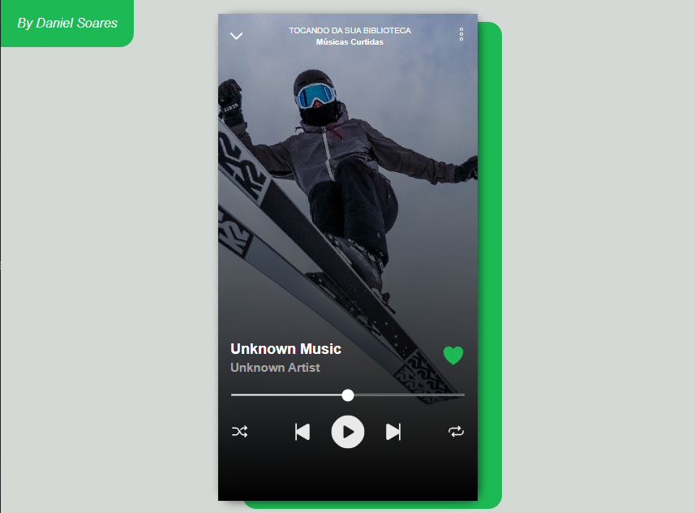

<h1 align="center"> Spotify mobile clone</h1>

  <a href="#-tecnologias">Tecnologias</a>&nbsp;&nbsp;&nbsp;|&nbsp;&nbsp;&nbsp;
  <a href="#-projeto">Projeto</a>

  

## 🚀 Tecnologias

Esse projeto foi desenvolvido com as seguintes tecnologias:

- HTML e CSS
- JavaScript
- Git e Github

## 💻 Projeto

Um desafio pessoal de desenvolver a interface mobile do player de músicas do Spotify, Com o intuito de aprender um pouco mais sobre HTML, CSS e JS. <a href="https://daniel-csoares.github.io/Spotify-clone-mobile/">Você pode acessar aqui</a>

---
